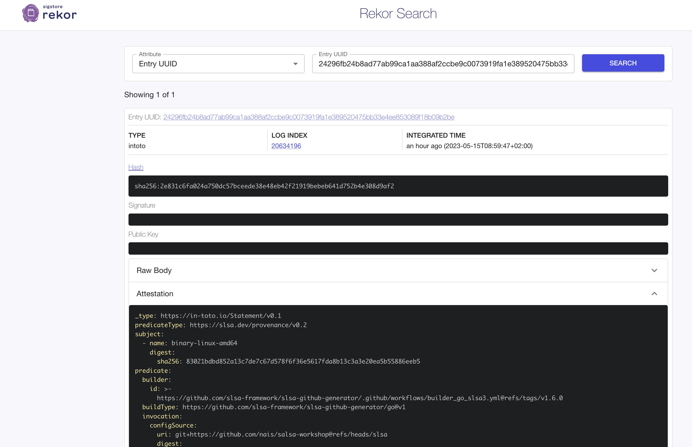

# lab-5 extra

## Goal

In this lab we will set up a GitHub workflow with the
official [SLSA Generator](https://github.com/slsa-framework/slsa-github-generator)
and the [SLSA Verifier](https://github.com/slsa-framework/slsa-verifier) to sign and verify attestations, this tools can
also be used to sign and verify container images and other arbitrary files.

The official SLSA Generator and Verifier follows the specification of [SLSA Provenance](https://slsa.dev/provenance/v1)
They let you meet the [provenance generation](https://slsa.dev/spec/v1.0/requirements#provenance-generation)
requirements for [SLSA Build level 3](https://slsa.dev/spec/v1.0/levels).

## Steps

### Build the Provenance

We will use
the [Go Generator](https://github.com/slsa-framework/slsa-github-generator/blob/main/internal/builders/go/README.md) in
this workshop, but you can use any builder you want.

Define a configuration file called `.slsa-goreleaser.yml` in the root of your project.

```yaml
# Version for this file.
version: 1

# (Optional) List of env variables used during compilation.
env:
  - GO111MODULE=on
  - CGO_ENABLED=0

# (Optional) Flags for the compiler.
flags:
  - -trimpath
  - -tags=netgo

# The OS to compile for. `GOOS` env variable will be set to this value.
goos: linux

# The architecture to compile for. `GOARCH` env variable will be set to this value.
goarch: amd64

# (Optional) Entrypoint to compile.
# main: ./path/to/main.go

# (Optional) Working directory. (default: root of the project)
# dir: ./relative/path/to/dir

# Binary output name.
binary: binary-{{ .Os }}-{{ .Arch }}
```

First set up the permissions for the Action:

```yaml
permissions:
  read-all: true
```

```yaml
    permissions:
      id-token: write # To sign the provenance.
      contents: write # To upload assets to release.
      actions: read # To read the workflow path.
```

Set up the SLSA generator

```yaml
    uses: slsa-framework/slsa-github-generator/.github/workflows/builder_go_slsa3.yml@v1.6.0
    with:
      go-version: "1.20"
```

This will in the end generate a SLSA provenance file and a SLSA artifact file and upload them. SLSA action use
reusable workflows, if you are not familiar with the concept, you
can [read more about it](https://github.com/slsa-framework/slsa-github-generator#what-is-slsa-github-generator)

Check the output of the workflow, you should see something like this:

```bash
provenance generator is slsa-builder-go-linux-amd64
Generating ephemeral keys...
Retrieving signed certificate...
Successfully verified SCT...
Retrieving signed certificate...
Uploaded signed attestation to rekor with UUID 24296fb24b8ad77ab99ca1aa388af2ccbe9c0073919fa1e389520475bb33e4ee853089f18b09b2be.
You could use rekor-cli to view the log entry details:

  $ rekor-cli get --uuid 24296fb24b8ad77ab99ca1aa388af2ccbe9c0073919fa1e389520475bb33e4ee853089f18b09b2be

In addition to that, you could also use the Rekor Search UI:

  https://search.sigstore.dev/?uuid=24296fb24b8ad77ab99ca1aa388af2ccbe9c0073919fa1e389520475bb33e4ee853089f18b09b2beUploaded signed attestation to rekor with UUID 24296fb24b8ad77ab99ca1aa388af2ccbe9c0073919fa1e389520475bb33e4ee853089f18b09b2be.
```



### Verify the Provenance

Add a verify job to your workflow

```yaml
      - uses: actions/checkout@v3
      - uses: actions/download-artifact@v3
        with:
          name: ${{ needs.build.outputs.go-provenance-name }}
      - uses: actions/download-artifact@v3
        with:
          name: ${{ needs.build.outputs.go-binary-name }}
      - name: Install verifier
        uses: slsa-framework/slsa-verifier/actions/installer@v2.3.0
      - name: Verify
        run: |
          slsa-verifier verify-artifact --provenance-path ${{ needs.build.outputs.go-provenance-name }} \
          --source-uri github.com/${{ github.repository }} ${{ needs.build.outputs.go-binary-name }}
```

Check the output of the workflow, you should see something like this:

```bash
Verified signature against tlog entry index 20634196 at URL: https://rekor.sigstore.dev/api/v1/log/entries/24296fb24b8ad77ab99ca1aa388af2ccbe9c0073919fa1e389520475bb33e4ee853089f18b09b2be
Verified build using builder https://github.comslsa-framework/slsa-github-generator/.github/workflows/builder_go_slsa3.yml@refs/tags/v1.6.0 at commit 4ef3627037c95ac0aaf12f77113df81ae6ed15d1
Verifying artifact binary-linux-amd64/binary-linux-amd64: PASSED

PASSED: Verified SLSA provenance
```


